# 前端类图 (Frontend Class Diagram)

## 1. 概述

前端采用 Vue 3 组合式 API (Composition API)，使用 Pinia 进行状态管理，Vue Router 进行路由管理。

**技术栈：**
- Vue 3.4
- Vite 5.0
- Pinia 2.1
- Vue Router 4.2
- Axios 1.6

---

## 2. 系统架构图

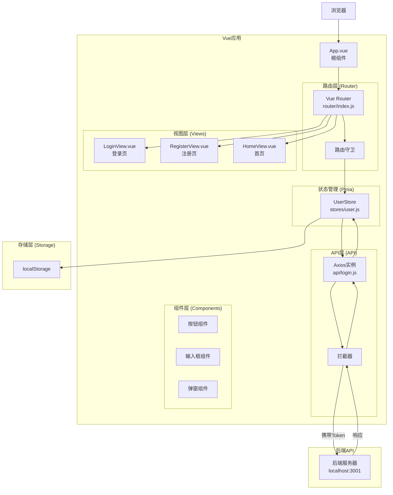

---

## 3. 类图详解

### 3.1 Vue应用根类

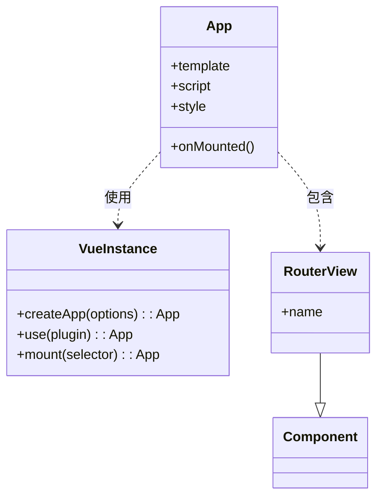

**生命周期：**
- `onMounted()`: 组件挂载后执行
  - 检查用户登录状态
  - 如果已登录，获取用户信息

---

### 3.2 路由类

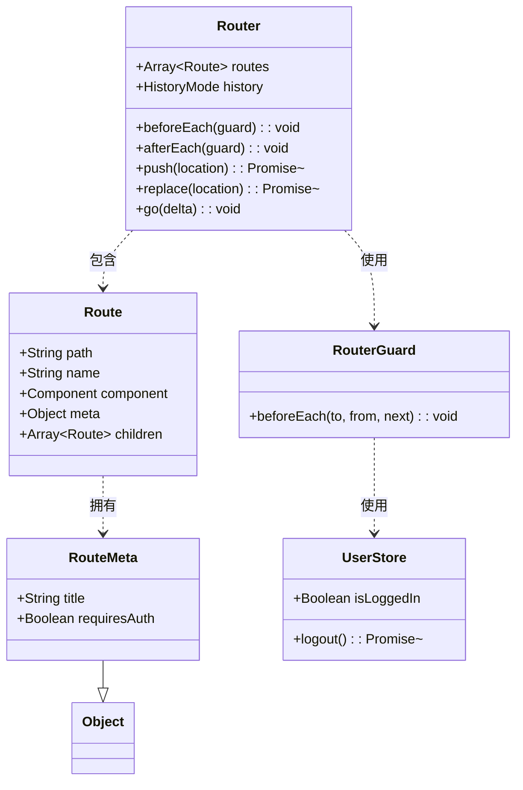

**路由配置：**

| 路径 | 名称 | 组件 | 需要认证 | 说明 |
|------|------|------|---------|------|
| / | - | 重定向到 /login | 否 | 默认路由 |
| /login | Login | LoginView.vue | 否 | 登录页面 |
| /register | Register | RegisterView.vue | 否 | 注册页面 |
| /home | Home | HomeView.vue | 是 | 首页 |

**路由守卫逻辑：**
```javascript
beforeEach((to, from, next) => {
  // 1. 设置页面标题
  document.title = to.meta.title || 'Vue应用'
  
  // 2. 检查是否需要认证
  if (to.meta.requiresAuth && !userStore.isLoggedIn) {
    next('/login')  // 未登录，跳转到登录页
  } else if ((to.path === '/login' || to.path === '/register') && userStore.isLoggedIn) {
    next('/home')  // 已登录，跳转到首页
  } else {
    next()  // 放行
  }
})
```

---

### 3.3 状态管理类 (Pinia Store)

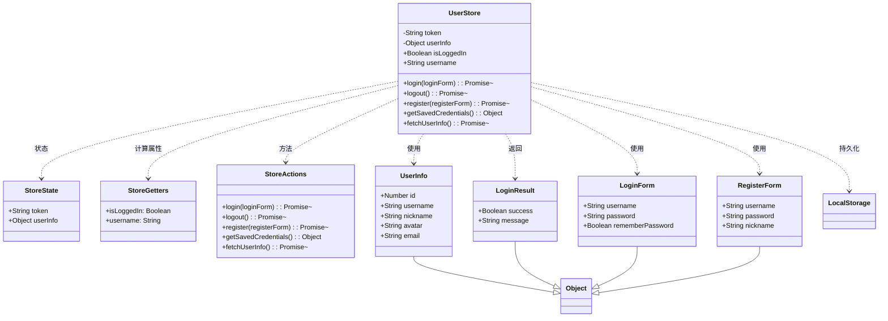

**State（状态）：**

| 属性 | 类型 | 默认值 | 说明 |
|------|------|--------|------|
| token | String | localStorage.getItem('token') 或 '' | JWT token |
| userInfo | Object | JSON.parse(localStorage.getItem('userInfo')) 或 null | 用户信息 |

**Getters（计算属性）：**

| Getter | 类型 | 说明 |
|--------|------|------|
| isLoggedIn | Boolean | 是否已登录（token是否存在） |
| username | String | 用户昵称或默认"用户" |

**Actions（方法）：**

| 方法 | 参数 | 返回值 | 说明 |
|------|------|--------|------|
| login | LoginForm | Promise<LoginResult> | 用户登录 |
| logout | 无 | Promise<LoginResult> | 退出登录 |
| register | RegisterForm | Promise<LoginResult> | 用户注册 |
| getSavedCredentials | 无 | Object | 获取保存的凭据 |
| fetchUserInfo | 无 | Promise<Object> | 获取用户信息 |

---

### 3.4 API客户端类

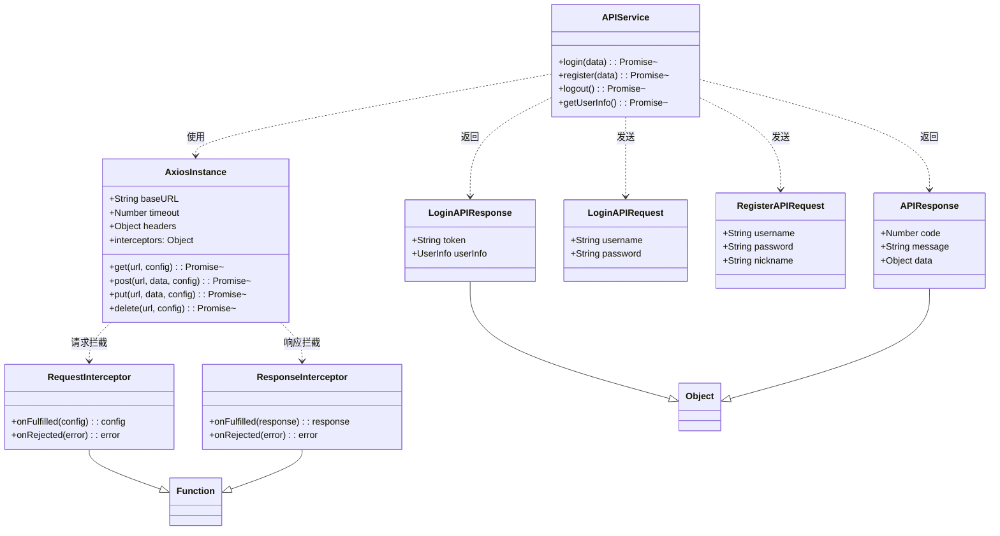

**API配置：**

| 配置项 | 值 | 说明 |
|--------|-----|------|
| baseURL | '/api' | API基础路径 |
| timeout | 5000 | 请求超时时间（毫秒） |

**请求拦截器：**
```javascript
config => {
  // 从localStorage获取token
  const token = localStorage.getItem('token')
  if (token) {
    config.headers['Authorization'] = `Bearer ${token}`
  }
  return config
}
```

**响应拦截器：**
```javascript
response => {
  const res = response.data
  console.log('API 成功响应:', res)
  return res
}
```

**错误拦截器：**
```javascript
error => {
  if (error.response && error.response.data) {
    // 后端返回错误，返回错误数据
    return error.response.data
  } else if (error.response) {
    // 有响应但没有数据
    return {
      code: error.response.status,
      message: `请求失败 (${error.response.status})`,
      data: null
    }
  } else {
    // 网络错误
    return Promise.reject(error)
  }
}
```

---

### 3.5 视图组件类

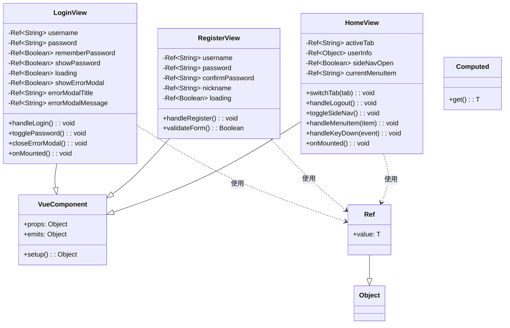

**LoginView 属性：**

| 属性 | 类型 | 说明 |
|------|------|------|
| username | Ref<String> | 用户名输入 |
| password | Ref<String> | 密码输入 |
| rememberPassword | Ref<Boolean> | 记住密码 |
| showPassword | Ref<Boolean> | 显示密码 |
| loading | Ref<Boolean> | 加载状态 |
| showErrorModal | Ref<Boolean> | 显示错误弹窗 |
| errorModalTitle | Ref<String> | 错误标题 |
| errorModalMessage | Ref<String> | 错误消息 |

**LoginView 方法：**

| 方法 | 说明 |
|------|------|
| handleLogin() | 处理登录提交 |
| togglePassword() | 切换密码显示/隐藏 |
| closeErrorModal() | 关闭错误弹窗 |

**HomeView 属性：**

| 属性 | 类型 | 说明 |
|------|------|------|
| activeTab | Ref<String> | 当前激活的Tab（'tab1' 或 'tab2'） |
| userInfo | Ref<Object> | 用户信息 |
| sideNavOpen | Ref<Boolean> | 侧边栏是否打开 |
| currentMenuItem | Ref<String> | 当前菜单项 |

**HomeView 方法：**

| 方法 | 说明 |
|------|------|
| switchTab(tab) | 切换Tab |
| handleLogout() | 处理退出登录 |
| toggleSideNav() | 切换侧边栏 |
| handleMenuItem(item) | 处理菜单项点击 |
| handleKeyDown(event) | 处理键盘事件（方向键切换Tab） |

---

### 3.6 组件类

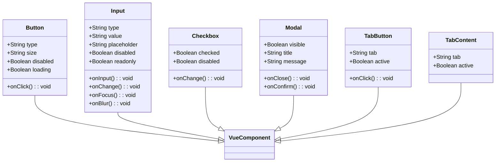

---

## 4. 时序图

### 4.1 用户登录流程

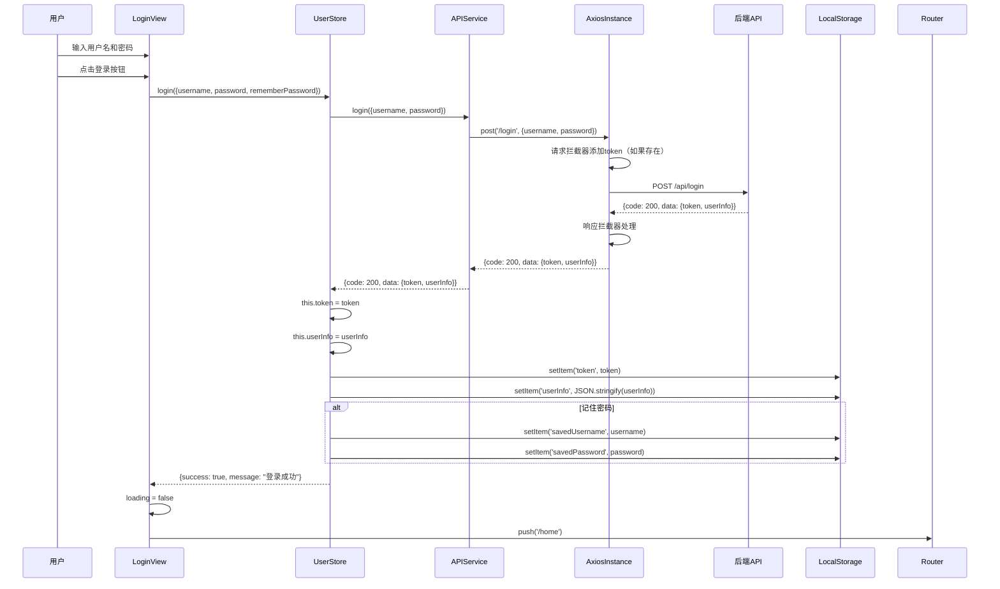

### 4.2 用户注册流程

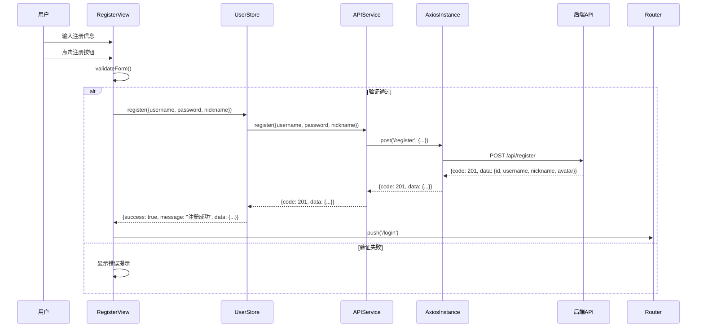

### 4.3 退出登录流程

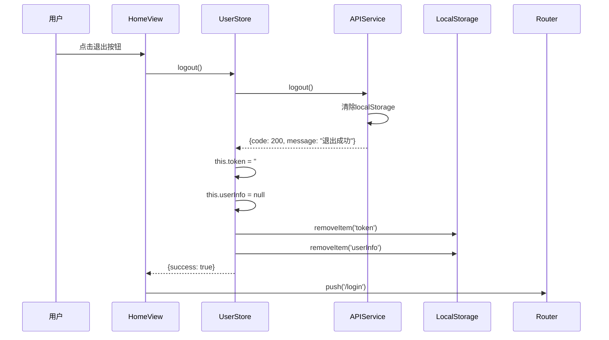

### 4.4 Tab切换流程

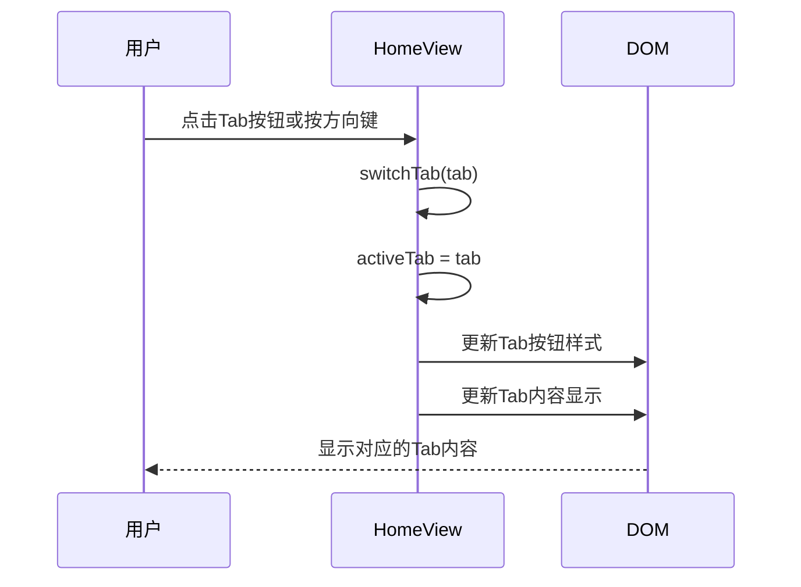

---

## 5. 组件关系图

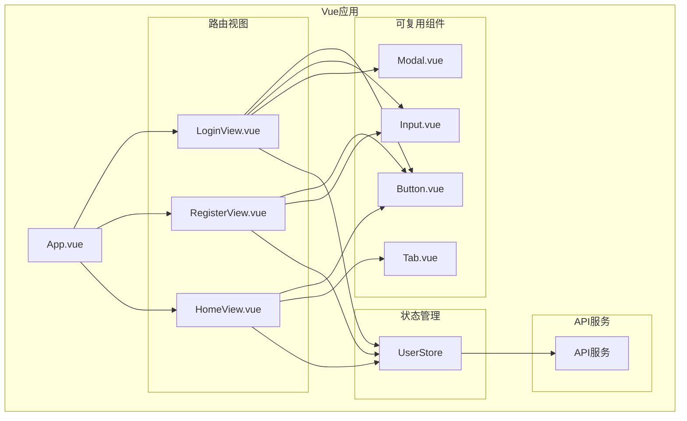

---

## 6. 数据流图

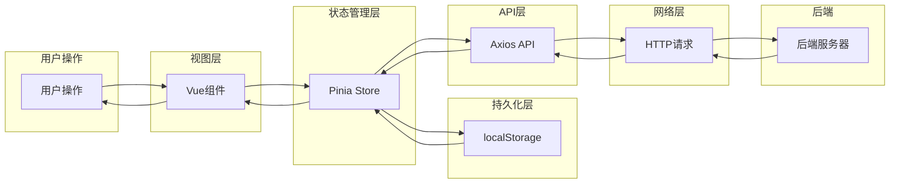

---

## 7. 响应式系统图

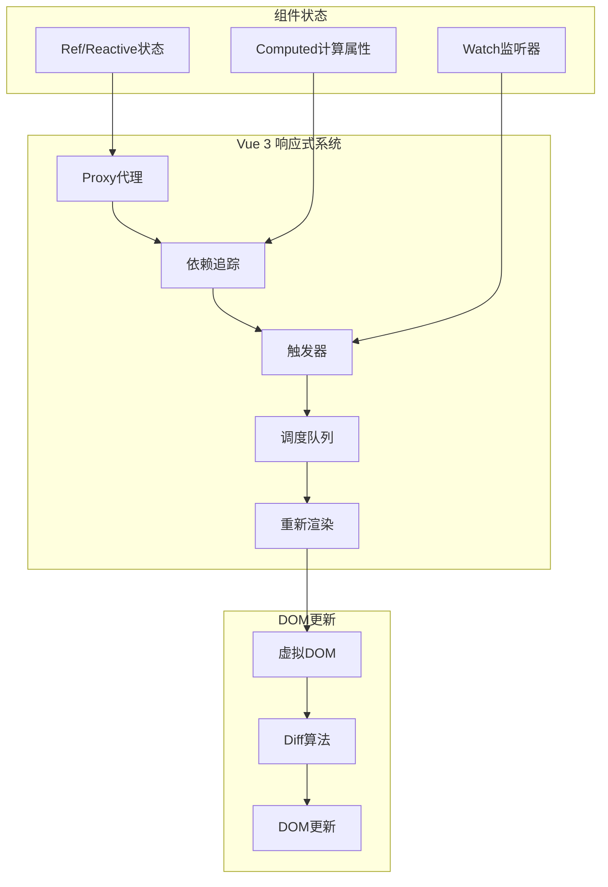

---

**文档版本：** v1.0
**创建日期：** 2026-01-26
**最后更新：** 2026-01-26
**文档状态：** 完成
