# 后端类图 (Backend Class Diagram)

## 1. 概述

后端采用 MVC（Model-View-Controller）架构模式，使用 Express 框架构建 RESTful API。

**技术栈：**
- Node.js
- Express 4.18
- MySQL 5.7+
- JWT 认证
- bcryptjs 密码加密

---

## 2. 系统架构图

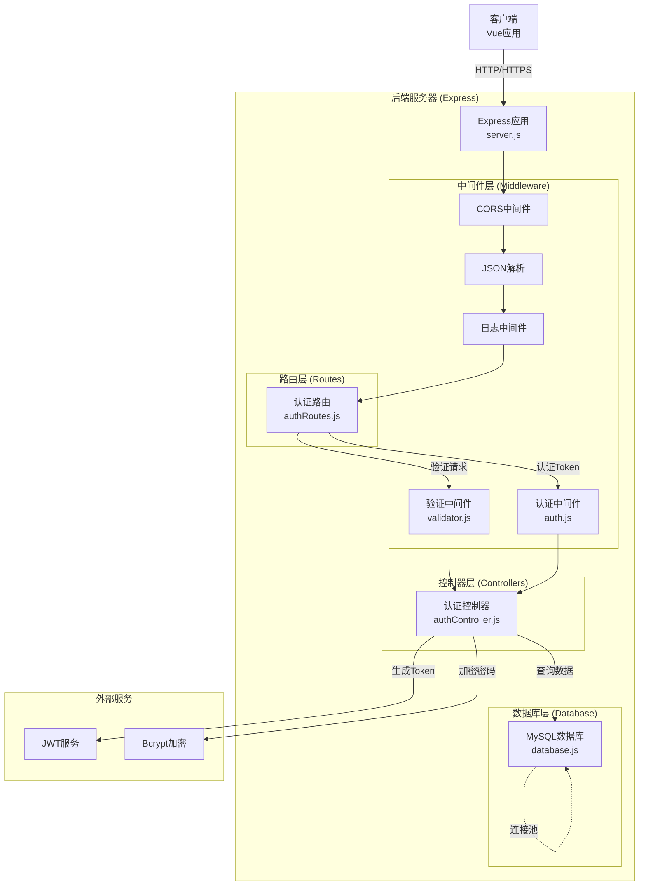

---

## 3. 类图详解

### 3.1 服务器应用类

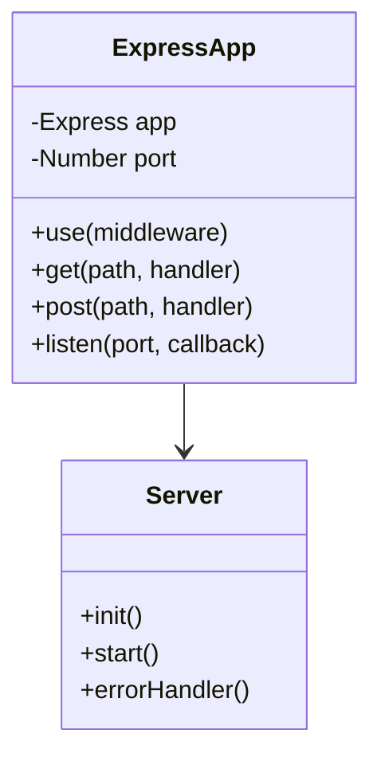

**属性说明：**
- `app`: Express 应用实例
- `port`: 服务器端口（默认 3001）

**方法说明：**
- `init()`: 初始化服务器配置和中间件
- `start()`: 启动服务器监听
- `errorHandler()`: 全局错误处理

---

### 3.2 认证控制器类

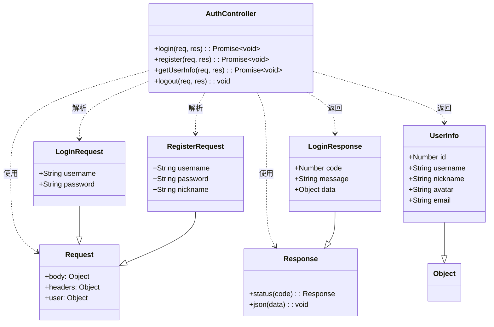

**方法说明：**

| 方法 | 请求 | 响应 | 说明 |
|------|------|------|------|
| `login` | POST /api/login | {token, userInfo} | 用户登录，返回JWT token |
| `register` | POST /api/register | {id, username, nickname, avatar} | 用户注册，创建新用户 |
| `getUserInfo` | GET /api/user/info | UserInfo | 获取当前登录用户信息 |
| `logout` | POST /api/logout | {message} | 用户退出登录 |

---

### 3.3 认证中间件类

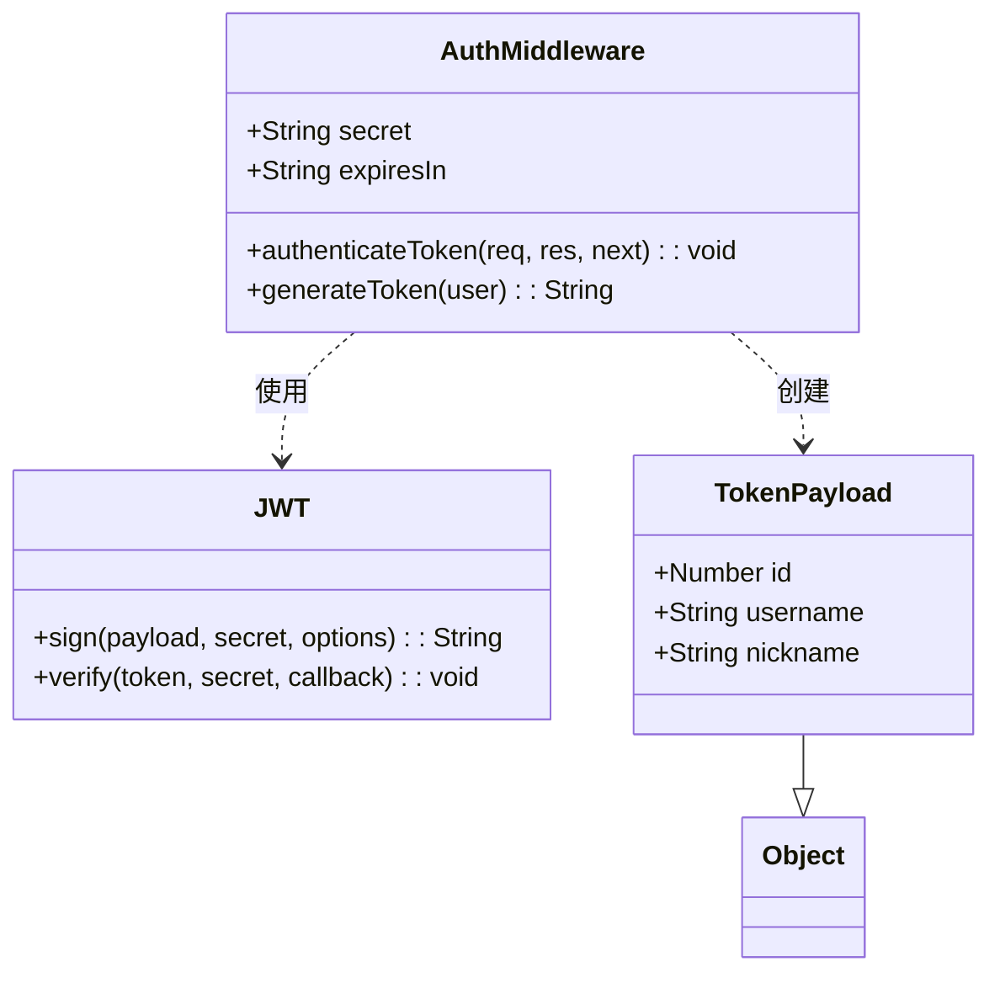

**属性说明：**
- `secret`: JWT密钥（从环境变量读取）
- `expiresIn`: Token过期时间（默认 24h）

**方法说明：**

| 方法 | 参数 | 返回值 | 说明 |
|------|------|--------|------|
| `authenticateToken` | req, res, next | void | 验证JWT token，将用户信息附加到req.user |
| `generateToken` | user对象 | String token | 生成JWT token |

**Token结构：**
```javascript
{
  id: 用户ID,
  username: 用户名,
  nickname: 昵称,
  iat: 签发时间,
  exp: 过期时间
}
```

---

### 3.4 验证中间件类

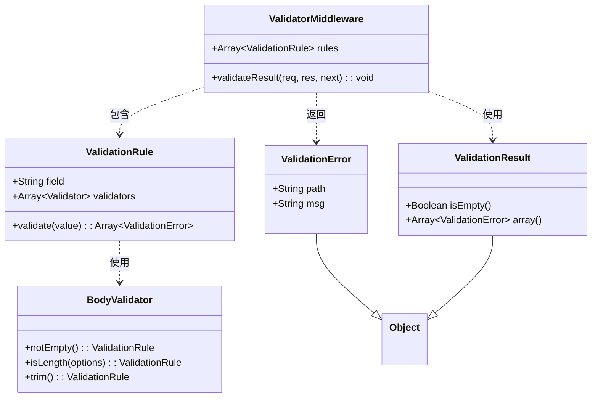

**验证规则：**

| 字段 | 验证规则 | 说明 |
|------|----------|------|
| username | notEmpty, length 3-50 | 用户名不能为空，长度3-50字符 |
| password | notEmpty, length ≥ 6 | 密码不能为空，至少6个字符 |

---

### 3.5 路由类

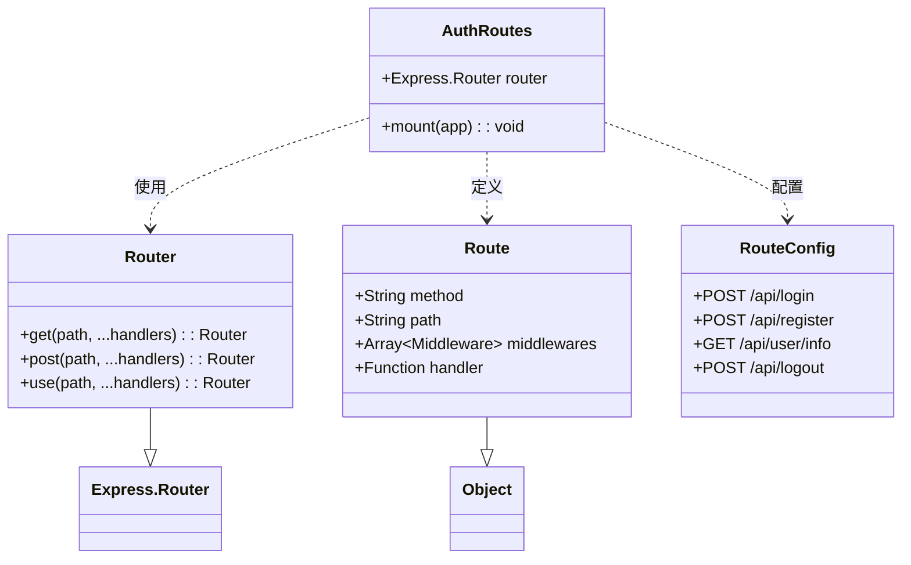

**路由配置：**

| 路径 | 方法 | 中间件 | 处理器 | 认证 |
|------|------|--------|--------|------|
| /api/login | POST | loginValidation, validateResult | login | 否 |
| /api/register | POST | 无 | register | 否 |
| /api/user/info | GET | authenticateToken | getUserInfo | 是 |
| /api/logout | POST | 无 | logout | 否 |

---

### 3.6 数据库类

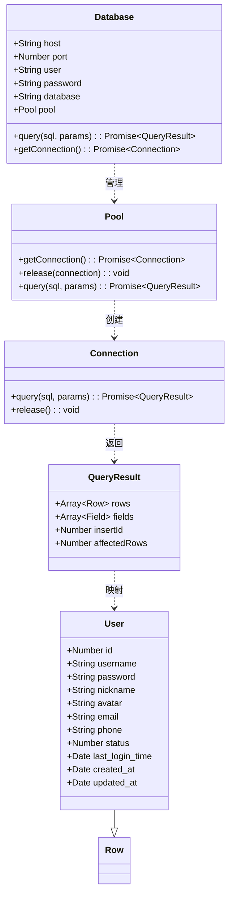

**数据库配置：**

| 参数 | 默认值 | 说明 |
|------|--------|------|
| host | localhost | 数据库主机 |
| port | 3306 | 数据库端口 |
| user | root | 数据库用户 |
| password | - | 数据库密码 |
| database | uisheji | 数据库名称 |
| connectionLimit | 10 | 连接池最大连接数 |

**User表结构：**

| 字段 | 类型 | 约束 | 说明 |
|------|------|------|------|
| id | INT | PRIMARY KEY, AUTO_INCREMENT | 用户ID |
| username | VARCHAR(50) | UNIQUE, NOT NULL | 用户名 |
| password | VARCHAR(255) | NOT NULL | 加密密码 |
| nickname | VARCHAR(50) | NULL | 昵称 |
| avatar | VARCHAR(255) | NULL | 头像URL |
| email | VARCHAR(100) | NULL | 邮箱 |
| phone | VARCHAR(20) | NULL | 手机号 |
| status | TINYINT | DEFAULT 1 | 状态（1-正常, 0-禁用） |
| last_login_time | TIMESTAMP | NULL | 最后登录时间 |
| created_at | TIMESTAMP | DEFAULT CURRENT_TIMESTAMP | 创建时间 |
| updated_at | TIMESTAMP | DEFAULT CURRENT_TIMESTAMP ON UPDATE | 更新时间 |

---

## 4. 时序图

### 4.1 用户登录流程

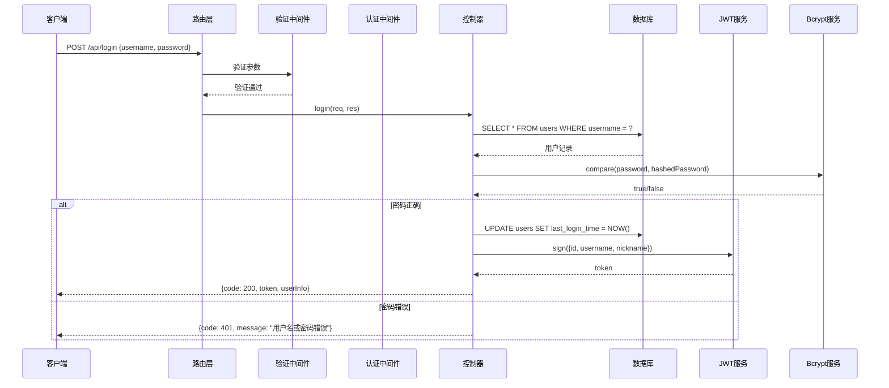

### 4.2 用户注册流程

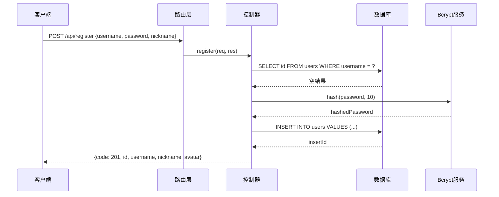

### 4.3 获取用户信息流程

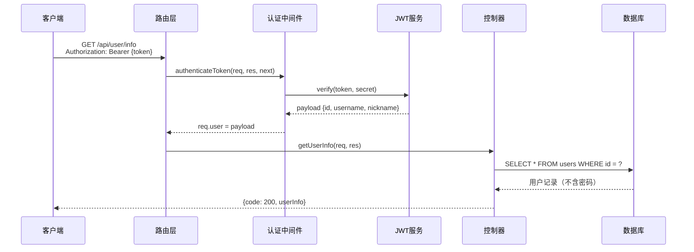

---

## 5. 依赖关系图

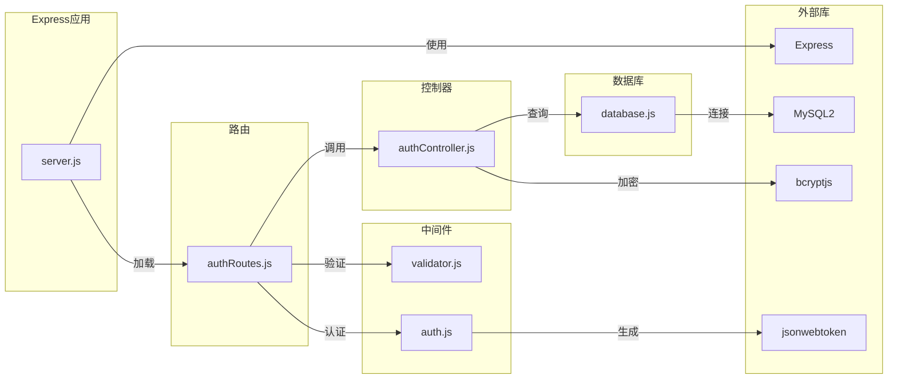

---

## 6. 数据流图

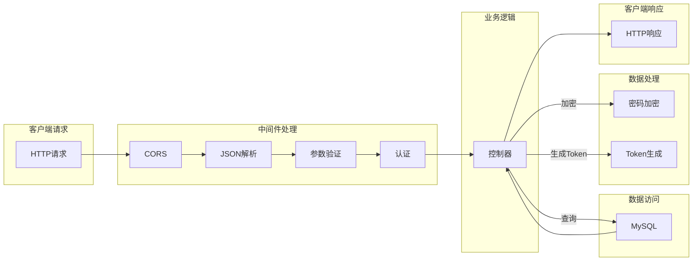

---

## 7. 错误处理流程

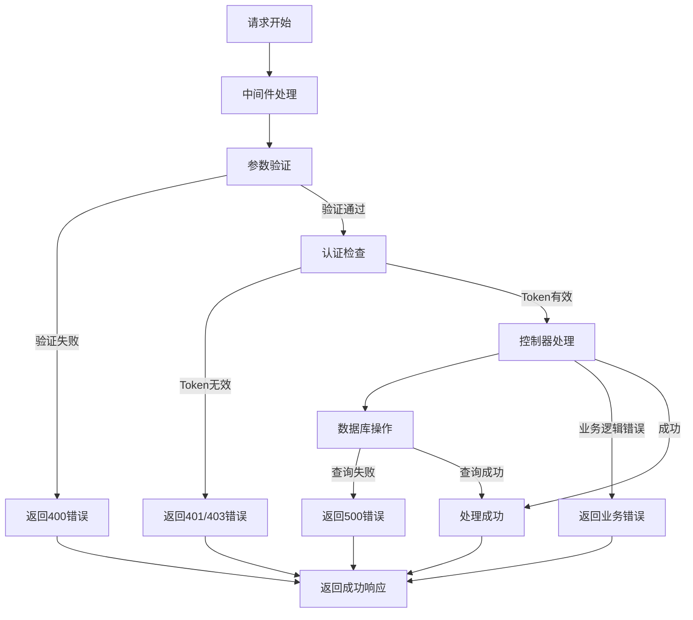

---

**文档版本：** v1.0
**创建日期：** 2026-01-26
**最后更新：** 2026-01-26
**文档状态：** 完成
