# 系统架构图 (System Architecture Diagram)

## 1. 概述

UI设计管理系统采用前后端分离架构，前端使用 Vue 3 + Vite，后端使用 Node.js + Express，数据库使用 MySQL。

**架构模式：**
- 前后端分离
- RESTful API
- JWT 认证
- MVC 设计模式

---

## 2. 整体架构图

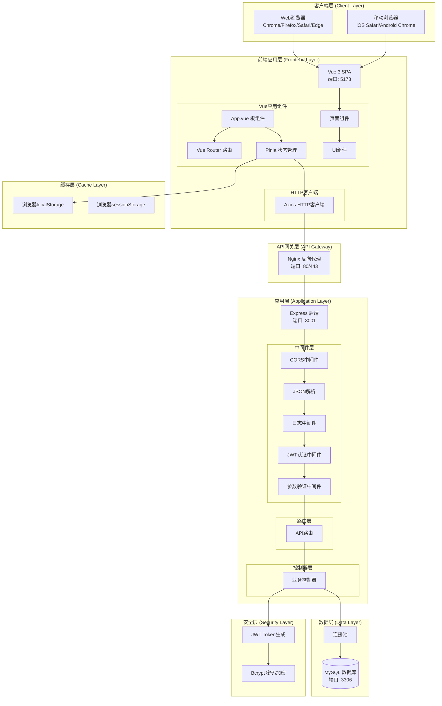

---

## 3. 部署架构图

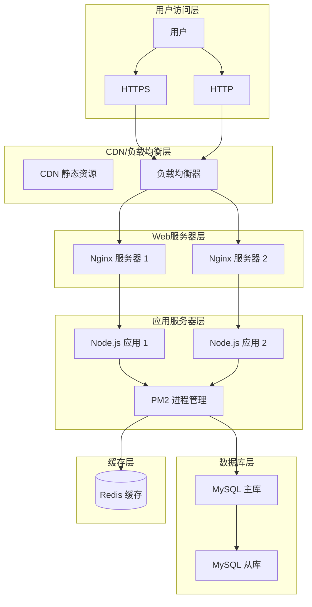

---

## 4. 数据流架构图

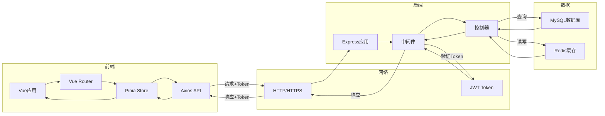

---

## 5. 认证流程架构图

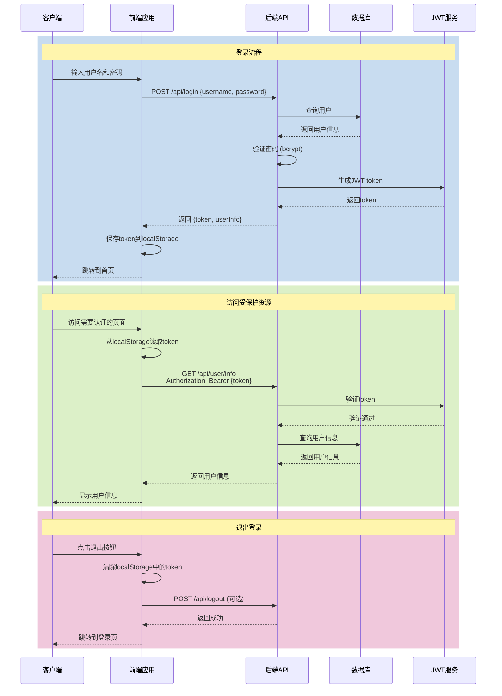

---

## 6. 技术栈架构图

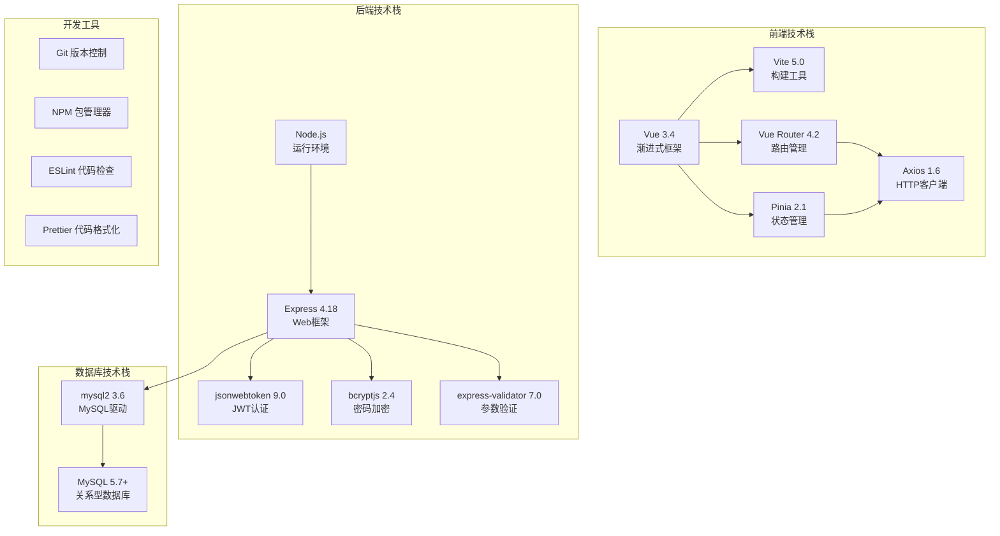

---

## 7. 分层架构图

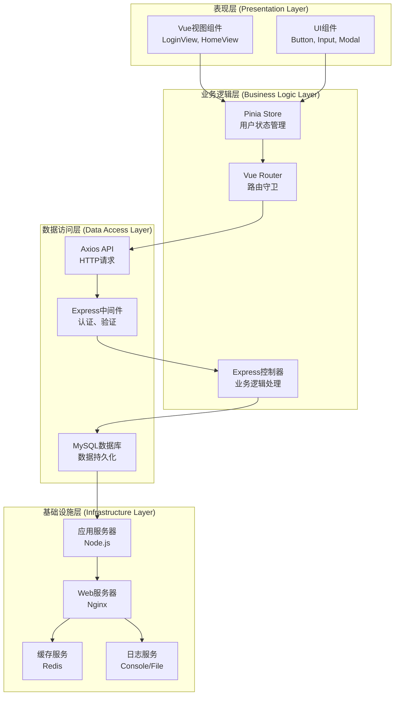

---

## 8. 微服务架构图（未来扩展）

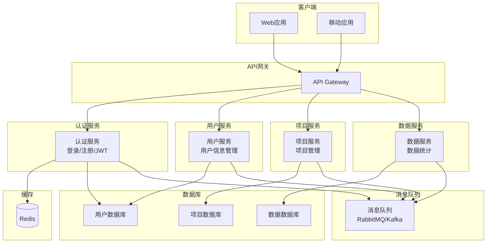

---

## 9. 安全架构图

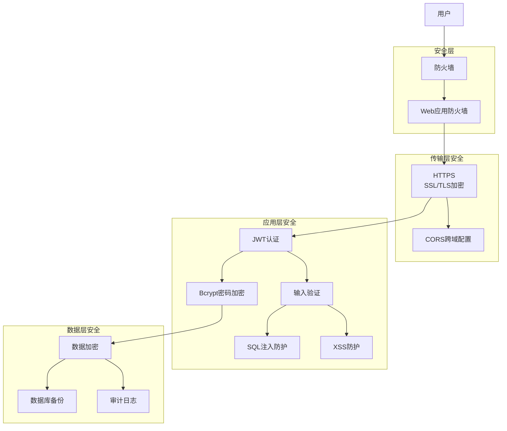

---

## 10. 性能优化架构图

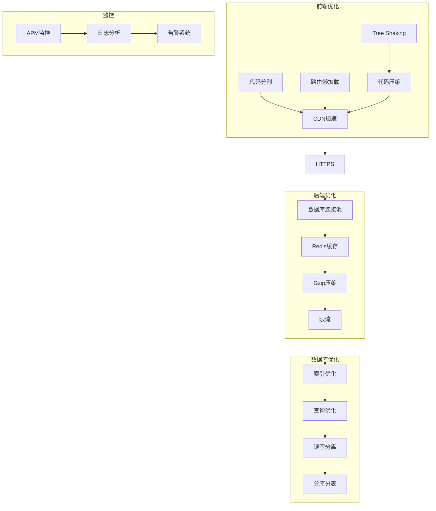

---

## 11. 开发环境架构图

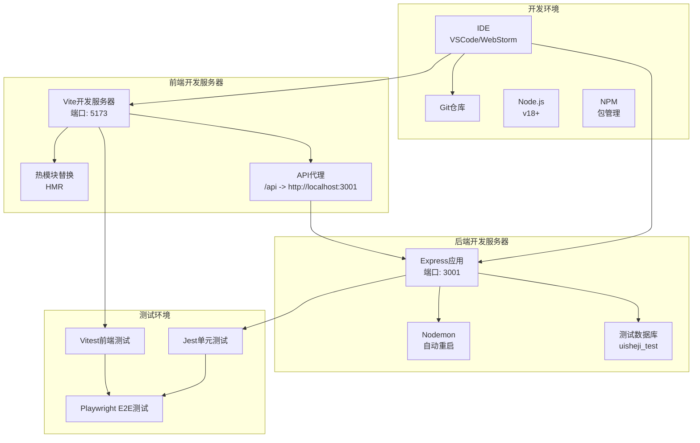

---

## 12. 生产环境架构图

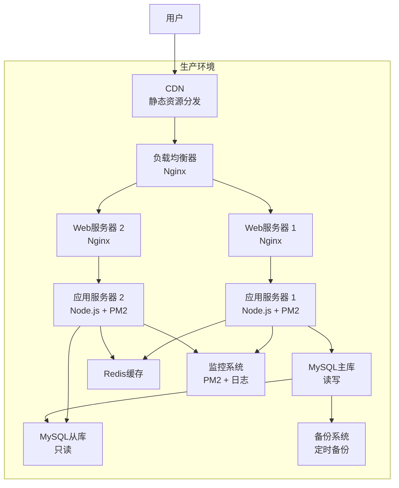

---

**文档版本：** v1.0
**创建日期：** 2026-01-26
**最后更新：** 2026-01-26
**文档状态：** 完成
